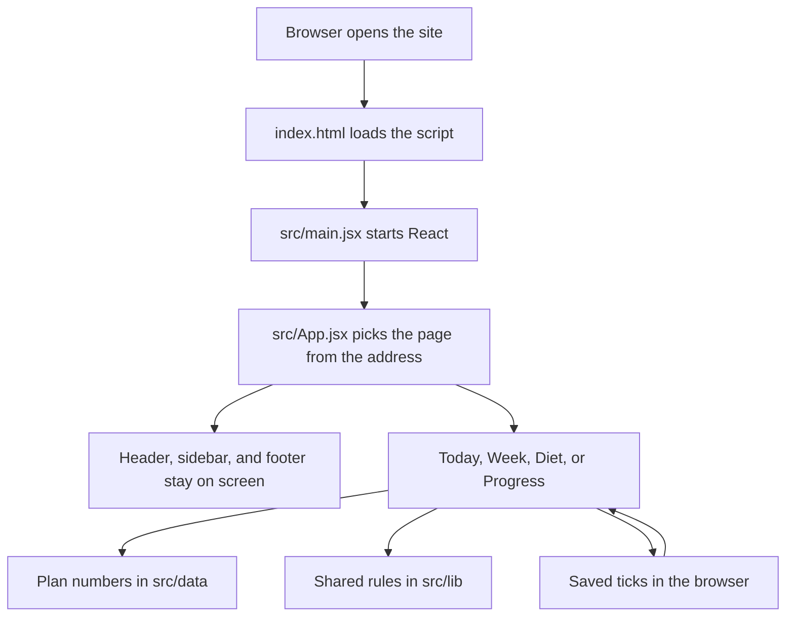
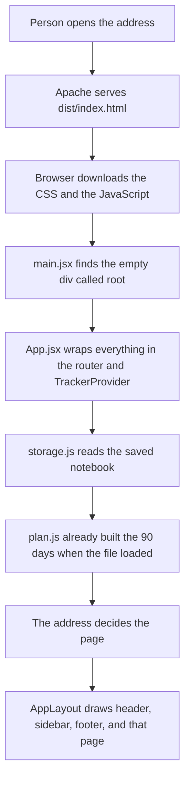
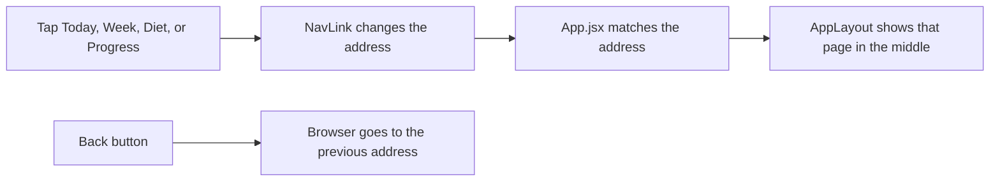
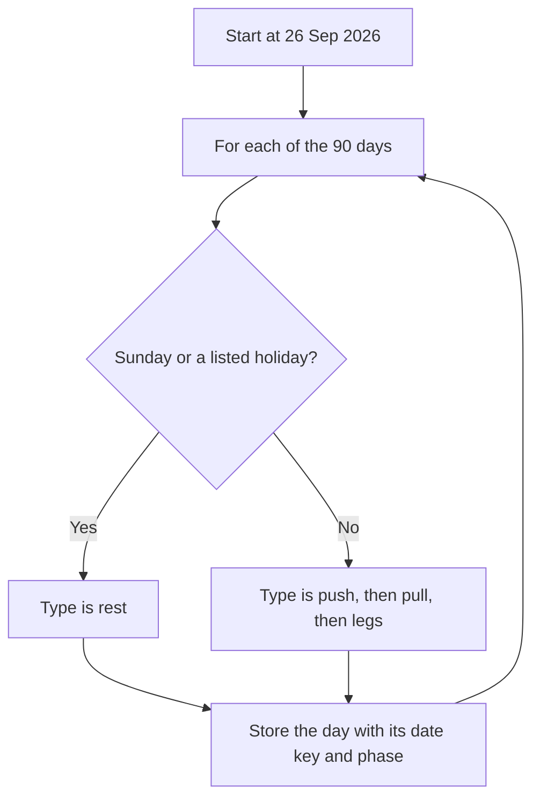
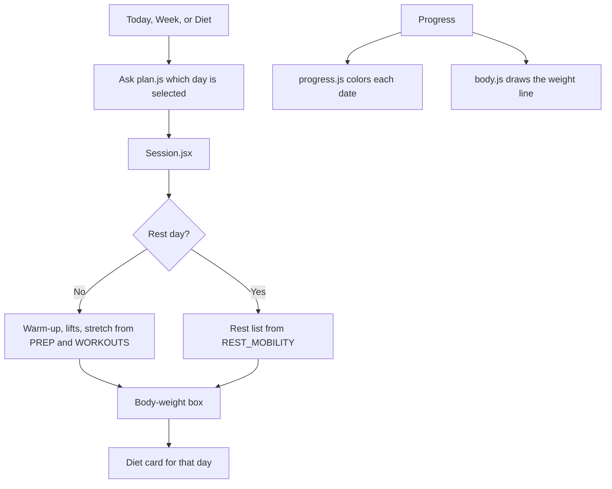
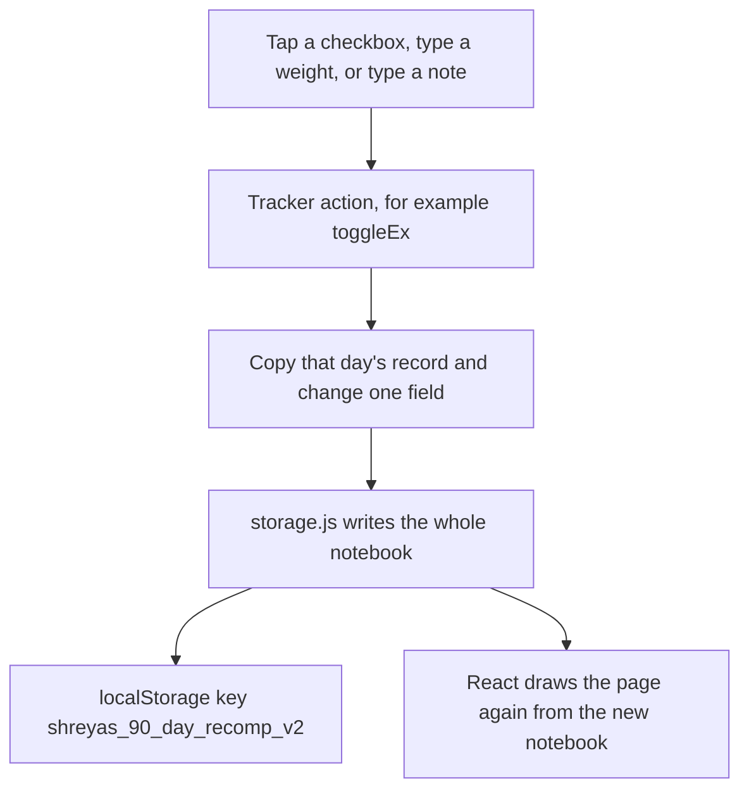
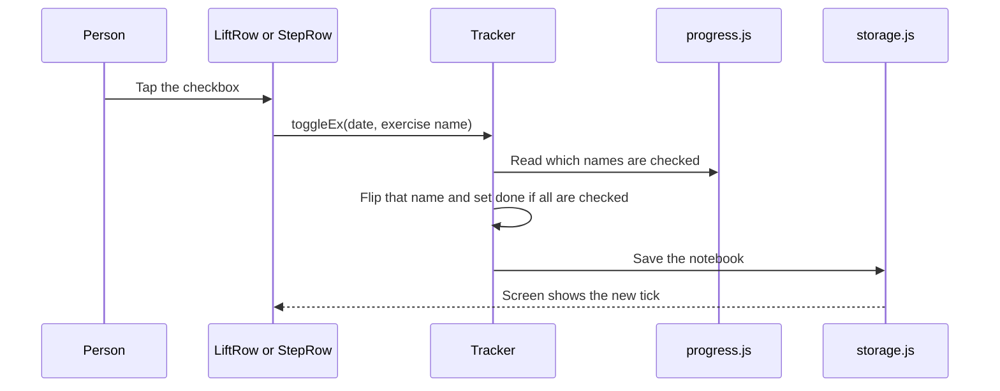
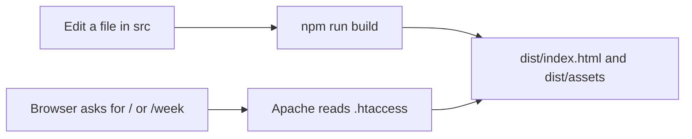

# 90-Day Recomp Tracker

This is a phone-and-computer page for one 90-day plan. It shows the workout for the day, the food for the day, and what you have already logged.

Nothing is sent to a server account. Ticks, notes, lift weights, and body weight stay in the browser on that device. The public address serves a built copy of this React app.

The plan starts on **26 September 2026** and runs **90 days**. Gym days rotate push, pull, and legs. Sunday and the listed holidays are rest. Food repeats every 7 days.

---

## Words used here

| Word | Plain meaning |
| --- | --- |
| Component | One piece of the screen, written as a function that returns HTML-like markup (JSX). |
| Route | The address of a page. `/` is Today. `/week` is Week. `/diet` is Diet. `/progress` is Progress. |
| State | The numbers and ticks the app is holding right now, such as “this box is checked”. |
| `localStorage` | A small notebook inside the browser. It survives a reload. It is wiped only if site data is cleared. |
| Build | Turning the source files into plain files a browser can open. Those files land in `dist/`. |
| Key | A date written as `2026-09-28`. Most saved rows use that string. |

---

## How to run it

From this folder:

```bash
npm install
npm run dev
```

`npm run dev` opens a local preview while you edit. It reloads when a file changes.

```bash
npm run build
```

`npm run build` writes the public site into `dist/`. Reload the live page after a build. The script name changes, so the phone fetches the new files. Do not clear site data. Clearing site data deletes the logged days.

---

## The big picture



Three kinds of files do the work:

1. **Data** — the plan you edit. Food, lifts, recipes, and exercise how-tos.
2. **Rules** — how a date becomes a push day, what “done” means, and how saving works.
3. **Screens** — the buttons and cards the person sees.

Screens ask the rules. The rules read the data. Screens do not copy the calendar math into each page.

---

## Folder map

```text
90days/
  index.html                 The shell the browser loads first
  package.json               Project name and the npm commands
  vite.config.js             How the build is made. Output folder is dist
  .htaccess                  Tells Apache to serve the built page
  public/manifest.webmanifest  Name and colors when the page is saved to a home screen

  src/main.jsx               Starts React
  src/App.jsx                Chooses the page from the address
  src/routes.js              The four addresses
  src/styles/app.css         All colors and layout

  src/data/plans.js          Dates, workouts, warm-ups, stretches, food
  src/data/recipes.js        How to cook each meal, plus a YouTube search
  src/data/moves.js          How to do each exercise, plus a YouTube search

  src/lib/dates.js           Today, adding days, writing a date
  src/lib/plan.js            The 90-day list, meals, and set changes
  src/lib/progress.js        Ticks, streaks, and calendar colors
  src/lib/body.js            Body-weight line
  src/lib/storage.js         Load and save in the browser

  src/state/Tracker.jsx      The shared notebook and the button actions

  src/layout/AppLayout.jsx   Puts header, page, sidebar, and footer together
  src/layout/Header.jsx      Top bar
  src/layout/Sidebar.jsx     Desktop side menu
  src/layout/Footer.jsx      Phone bottom tabs
  src/layout/sections.js     Labels and icons for the four pages
  src/layout/ImportFile.jsx  Hidden file picker for a backup

  src/components/Today.jsx
  src/components/Week.jsx
  src/components/Diet.jsx
  src/components/Progress.jsx
  src/components/Session.jsx     The day card: workout, weight, meals
  src/components/Icons.jsx
  src/components/GuideModal.jsx  The shared popup frame
  src/components/RecipeModal.jsx Popup for a meal
  src/components/MoveModal.jsx   Popup for an exercise

  dist/                      Built site. This is what visitors get
```

`node_modules/` is installed packages. Do not edit it.

`js/app.js`, `js/plans.js`, and `css/app.css` at the project root are the old single-page version. The live app does not read them. Edit `src/` instead.

---

## What happens when the page opens



Step by step:

1. `index.html` has one empty box, `<div id="root">`, and a script tag. Vite fills that script tag when it builds.
2. `src/main.jsx` calls `createRoot` on that box, loads `src/styles/app.css`, and draws `App`.
3. `src/App.jsx` starts React Router (`BrowserRouter`) and the shared notebook (`TrackerProvider`).
4. `TrackerProvider` calls `load()` once. That reads `localStorage`.
5. The address is read. `/week` means the Week page. Anything unknown is sent back to `/`.
6. `AppLayout` draws the frame. The page component draws the cards inside the frame.

The 90-day list is built once, when `src/lib/plan.js` is first imported. It does not rebuild on every tap.

---

## How the four pages are chosen

| Address | Page file | What you see |
| --- | --- | --- |
| `/` | `src/components/Today.jsx` | Today’s session, or the first day if the plan has not started |
| `/week` | `src/components/Week.jsx` | Seven days, then the selected day |
| `/diet` | `src/components/Diet.jsx` | The week strip, then three meal cards |
| `/progress` | `src/components/Progress.jsx` | Weight line, numbers, phases, and the 90-day board |

`src/routes.js` holds those four addresses. `pathFor('week')` returns `/week`. `viewFromPath('/diet')` returns `diet`. An old saved name `plan` is treated as Week.



The phone tabs are `Footer.jsx`. The desktop menu is `Sidebar.jsx`. Both use the same list from `layout/sections.js`. Tapping the page you are already on scrolls to the top and jumps the week back to the current week.

Arrow keys on Week and Diet move one week left or right, unless the cursor is in a text box.

---

## Where the plan numbers live

Edit **`src/data/plans.js`** when the plan itself changes.

| Name in the file | What it is |
| --- | --- |
| `START` | First day. The month number is 0-based, so `8` means September. |
| `DAYS` | Length of the plan. It is 90. |
| `HOLIDAYS` | Extra closed days, keyed by `YYYY-MM-DD`. |
| `WORKOUTS` | Push, pull, and legs. Each lift has a name, sets, reps, and rest. |
| `PREP` | Warm-up before the lifts and stretches after, for each of those three days. |
| `REST_MOBILITY` | The easy list used on Sunday and holidays. |
| `PHASES` | Foundation, Progression, Intensification, and the sentence shown on Progress. |
| `FOOD` | Calories, protein, and fiber for one gram of each ingredient. |
| `MENUS` | Seven days of breakfast, lunch, and dinner. The list then repeats. |

Edit **`src/data/recipes.js`** to change cooking steps. The key must match the dish name on the meal card, letter for letter.

Edit **`src/data/moves.js`** to change exercise steps. The key must match the exercise name on the session card.

YouTube buttons open a search for that dish or exercise. They do not upload anything.

---

## How one day is built

`buildDays()` in `src/lib/plan.js` walks from day 0 to day 89.



Rules inside that loop:

- Sunday is rest, even if it is not in `HOLIDAYS`.
- A holiday is rest. If it is also Sunday, the label joins both names.
- Open days count only gym days. Day 1 of gym days is push, then pull, then legs, then push again.
- Days 1–30 are Foundation, 31–60 are Progression, 61–90 are Intensification. In code those ranges start at 0, so day index 0–29, 30–59, and 60–89.
- In Progression, a lift written `3 × 8–12` becomes `3 × 8–10`. A lift written `2 × 8–12` becomes `3 × 8–10`.
- In Intensification, a lift written `3 × 8–12` becomes `3 × 6–10`. Other rep schemes stay as written.
- The meal is `MENUS[day number % 7]`. Day 1 and day 8 share the same plate.

`menuFor` adds up the grams in `FOOD` and rounds calories, protein, and fiber. Oil is always shown as “½ teaspoon oil”.

---

## How a screen is drawn



`Today.jsx` asks `focusDay()`. If today is inside the 90 days, that day is shown. If today is before the start, day 1 is shown. If today is after the end, a short “plan complete” card is shown.

`Week.jsx` shows Monday to Sunday around the current week. Days outside the plan are marked Before or After. The selected day uses the same session card as Today.

`Diet.jsx` shows the selected day and the next two plates. On the last days of the plan it keeps the last three plates on screen.

`Progress.jsx` shows the weight chart, four counts, the three phases, the month boards, a form to edit a weigh-in, and the backup buttons.

`Session.jsx` is the shared day card. Today and Week both use it, so a workout change is made once.

| Piece inside Session.jsx | Job |
| --- | --- |
| `Hero` | Date, phase, push/pull/legs or rest, and the day’s calories |
| `Exercise` | Warm-up, lifts, cardio line, stretches, weight, note, and the complete button |
| `Rest` | Recovery list, weight, and note |
| `WeighIn` | The kilogram box under the stretches |
| `LiftRow` | One lift: checkbox, sets, weight box, last weight |
| `StepRow` | One warm-up, stretch, or recovery move |
| `DietCard` | One day’s three meals |
| `DietEmbed` | Puts that meal card under the workout on Today and Week |
| `SideFacts` | Gym done, gym left, streak, and the next gym session |

`Icons.jsx` is only the small drawings. `GuideModal.jsx` is the dark popup frame. `RecipeModal` fills it with a meal. `MoveModal` fills it with an exercise.

---

## How a tap is saved

`src/state/Tracker.jsx` is the only place that changes the notebook. Screens call `useTracker()` and get the actions.



The notebook looks like this:

```json
{
  "days": {
    "2026-09-28": {
      "done": false,
      "notes": "",
      "weights": { "Lat Pulldown": "40" },
      "checks": { "Lat Pulldown": true },
      "eaten": { "breakfast": true }
    }
  },
  "body": [
    { "date": "2026-09-28", "weight": 78.5, "waist": null }
  ]
}
```

| Field | Meaning |
| --- | --- |
| `done` | The day is logged. This is also set when every named move is checked. |
| `checks` | Each warm-up, lift, and stretch by name. |
| `weights` | The text typed in a lift’s kilogram box. |
| `notes` | The session note. |
| `eaten` | Breakfast, lunch, or dinner marked eaten. |
| `body` | One body-weight row per date. Waist is optional and used by the edit form. |

`src/lib/storage.js` details:

- The current key is `shreyas_90_day_recomp_v2`.
- If that key is empty, an older key `shreyas_90_day_recomp_v1` is read. In that old shape, a date set to `true` becomes a finished day.
- `save` writes the notebook back. If the browser blocks storage, a warning banner is shown.
- `rememberView` stores the current page name in `sessionStorage` under `recomp-view`. That value lasts for the browser tab. The address is still what picks the page.
- Export downloads `90-day-recomp-backup.json`. Import reads that file and replaces the notebook after a confirm. Reset clears it after a confirm.

What “done” means, in `progress.js`:

- If the day is marked done, it is done.
- Otherwise it is done when every warm-up, lift, and stretch name is checked.
- If an old day has `done: true` and no checklist yet, every move counts as checked.
- A holiday cell is gray. A future day is navy. A finished day is green. An unfinished past or current day is red, and the red gets darker as more of that day is ticked.

The gym streak counts finished gym days backward from today. Rest days are skipped. A past gym day that is not finished breaks the streak.

---

## Common paths, one by one

### Tick one exercise



“Mark session complete” calls `toggleDay`. That checks every move, or clears them if the day was already complete.

### Type a body weight

The box under stretching calls `setBodyWeight`. A number from 20 to 400 is saved for that date. Empty clears that date. A half-typed value such as `78.` is left alone until it is a real number. The note under the box compares it with the previous saved weight.

Progress reads the same `body` list. `chartModel` turns two or more weights into the line. One weight shows the number and waits for a second day.

### Open a meal

The icon on a meal calls `RecipeModal`. `recipeFor(dish name)` looks up `src/data/recipes.js`. The popup lists the steps and a YouTube link. Escape or the dark backdrop closes it.

### Open an exercise

The icon on a warm-up, lift, stretch, cardio line, or rest move calls `MoveModal`. `moveFor(name)` looks up `src/data/moves.js`. Same popup frame, different words.

### Open a day from the calendar

A colored square calls `gotoDay`. That sets the week to the Monday of that date, selects the day, and goes to `/week`.

---

## Each file, in the order the app uses it

### Root files

| File | What it does |
| --- | --- |
| `package.json` | Names the app `90-day-recomp`. `npm run dev` previews. `npm run build` writes `dist/`. Depends on React 19, React Router 7, and Vite 6. |
| `vite.config.js` | Uses the React plugin. Asset addresses start at `/`. The build folder is `dist`, and each build empties that folder first. |
| `index.html` | Title, phone settings, font link, favicon, manifest link, and the root box. |
| `.htaccess` | The public folder is this project, but visitors get `dist/`. Requests for `/week`, `/diet`, and `/progress` also return the built page so a refresh works. Requests for `src/`, `js/`, `css/`, and `node_modules/` are refused. |
| `public/manifest.webmanifest` | Home-screen name, colors, and icon file names. |

### `src/main.jsx` and `src/App.jsx`

`main.jsx` is the on switch. `App.jsx` is the map. The layout route wraps the four pages, so the header and tabs stay put while the middle changes.

### `src/routes.js` and `src/layout/`

`routes.js` is the list of pages. `sections.js` adds the icon component for each page. `AppLayout.jsx` measures the top bar, listens for arrow keys, shows the storage warning, and places the toast. `Header.jsx` shows the day count, the page title, the thin progress bar, the gym count, and Back. `Sidebar.jsx` is the desktop column, including the next gym session. `Footer.jsx` is the four tabs fixed to the bottom of the phone. `ImportFile.jsx` is an invisible file input. Progress calls `openImport()` to click it.

### `src/state/Tracker.jsx`

This file owns the notebook and the actions. It does not draw the cards.

Actions worth knowing:

| Action | Effect |
| --- | --- |
| `prepareSection` | On Today, Week, or Diet, jump the week to the focused day. |
| `openSection` | Do that, then change the address if needed. |
| `goBack` | Browser back, or return to Today if there is no earlier page in this visit. |
| `shiftWeek` / `thisWeek` | Move the visible week, staying inside the plan. |
| `selectDay` | Choose a day inside the current week. |
| `gotoDay` | Open that date on the Week page. |
| `showGuide` | Open Progress and scroll to the plan rules. |
| `toggleDay` / `toggleEx` | Complete a day, or flip one move. |
| `setNote` / `setLiftWeight` / `fillWeights` | Note, one lift weight, or copy last time into empty boxes. |
| `setBodyWeight` / `saveBodyForm` / `deleteBody` | Daily weight, the edit form, or remove one weigh-in. |
| `toggleMeal` | Mark breakfast, lunch, or dinner eaten. |
| `exportData` / `importData` / `resetProgress` | Backup file, restore, or erase. |

`upcomingSession` picks the side card: today’s gym session if it is not done, otherwise the next open gym day.

### `src/lib/`

| File | Job |
| --- | --- |
| `dates.js` | `iso` writes `YYYY-MM-DD`. `addDays` and `mondayOf` move dates. `fmt` and `fmtLong` write labels. `num` reads `78,5` or `78.5`. `today` is midnight local time. `phaseName` picks the phase from the day index. |
| `plan.js` | Builds `plan`, `planByKey`, the end date, and the gym count. Looks up meals, portions, the next gym day, the focused day, and the week that contains a date. |
| `progress.js` | Checklist math, last lift weight, streak, counts, calendar color, month grids, and phase bars. |
| `body.js` | Sort weigh-ins, find the previous one, write “+0.4 kg from …”, and compute the chart points. |
| `storage.js` | Read, write, empty, import, and the view memory described above. |

### `src/data/`

`plans.js` is the plan. `recipes.js` is cooking text. `moves.js` is exercise text. If a name is missing, the popup still opens with a short fallback and a YouTube search for that name.

### `src/components/`

| File | Job |
| --- | --- |
| `Today.jsx` | Chooses today’s day and lays out hero, session, side facts, and meals. |
| `Week.jsx` | Week bar, seven buttons, then the same day layout. |
| `Diet.jsx` | Intro, week strip labeled Paneer or Soya or the short name, then three `DietCard`s. |
| `Progress.jsx` | Chart, metrics, phases, board, weigh-in editor, rules, export, import, reset. |
| `Session.jsx` | Everything on a single day, shared by Today and Week. |
| `GuideModal.jsx` | Popup shell: title, steps, link, Escape to close. |
| `RecipeModal.jsx` | Meal lookup, then the shared popup. |
| `MoveModal.jsx` | Exercise lookup, then the shared popup. |
| `Icons.jsx` | SVG icons for the tabs, back, and the guide button. |

### `src/styles/app.css`

One stylesheet. Class names on the components match this file. The page background, cards, push/pull/legs edge colors, the phone tab bar, and the desktop sidebar all live here. A screen change that only moves color should be made here, not by inventing a second stylesheet.

---

## Calendar colors

| Look | Meaning |
| --- | --- |
| Green | Every exercise that day is done |
| Red | The day is today or in the past and is not finished. Darker red means more of it is ticked |
| Gray | Holiday |
| Navy | Still ahead |

Sunday rest uses red or green from the recovery checklist, unless that Sunday is also a listed holiday. Then it is gray.

---

## How the public site is served



Source files stay on disk for editing. The visitor’s browser runs the built files. After a build, one reload is enough. The saved notebook key does not change, so old ticks remain.

---

## What to edit for a common change

| You want to change | Open this file |
| --- | --- |
| A lift, a warm-up, a stretch, a holiday, or a meal portion | `src/data/plans.js` |
| Cooking steps or the meal video search | `src/data/recipes.js` |
| Exercise steps or the exercise video search | `src/data/moves.js` |
| Colors, spacing, or the phone tab bar | `src/styles/app.css` |
| What Today shows | `src/components/Today.jsx` |
| The week strip | `src/components/Week.jsx` |
| The diet page | `src/components/Diet.jsx` |
| The progress page | `src/components/Progress.jsx` |
| The workout card used by Today and Week | `src/components/Session.jsx` |
| When a day counts as done, or the board color | `src/lib/progress.js` |
| Phase set changes or the 7-day meal cycle | `src/lib/plan.js` |
| The save key or the backup shape | `src/lib/storage.js` |

After the edit, run `npm run build` if the change should show on the public address.
